# LS Project

##  Achieving Enterprise-Grade Kubernetes Security with GitOps-Enabled Deployments, Azure Cloud, and Hardening Techniques

This repository contains the code and configuration files necessary to deploy a Kubernetes application on Azure Cloud using GitOps approach. The deployment process follows the Microsoft Architecture Center best practices for enterprise-grade deployments and is designed to be secure and compliant with regulated environments.
##  Dependencies

@octopus237

[octopus237/Gitops-project-app](https://github.com/octopus237/Gitops-project-app)

[octopus237/GitOps-project](https://github.com/octopus237/GitOps-project)

### Overview
GitOps is a modern approach to managing infrastructure and applications in a Kubernetes environment. It involves using Git as the source of truth for all configuration files and manifests, and relying on a continuous delivery pipeline to automatically apply changes to the Kubernetes environment.

The benefits of using GitOps include increased visibility, traceability, and auditability of changes made to the Kubernetes environment, as well as faster and more consistent deployments.
### Architecture
> Complete architecture diagram could be found at: [Large Systems Project](https://husseinahmed-dev.github.io/LS-Project/)

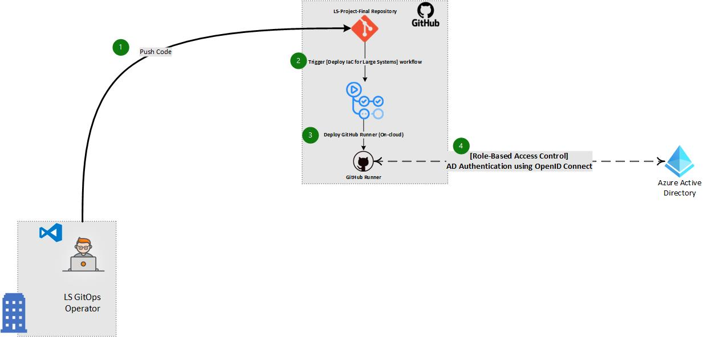
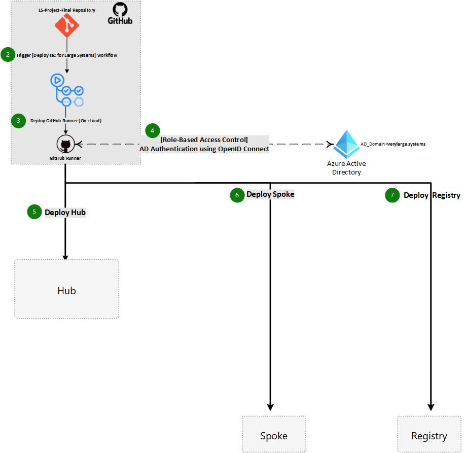
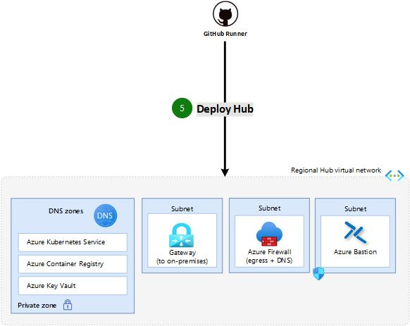
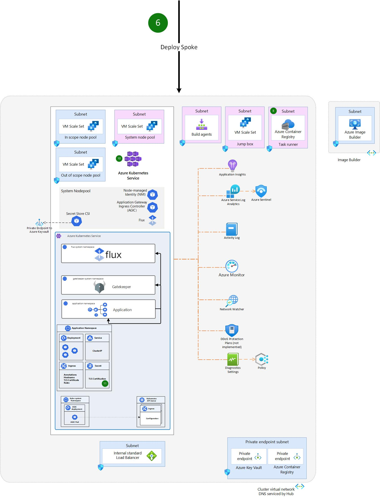
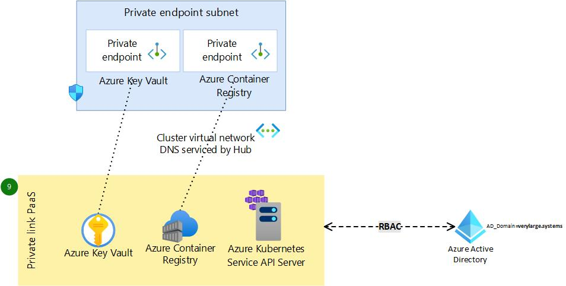
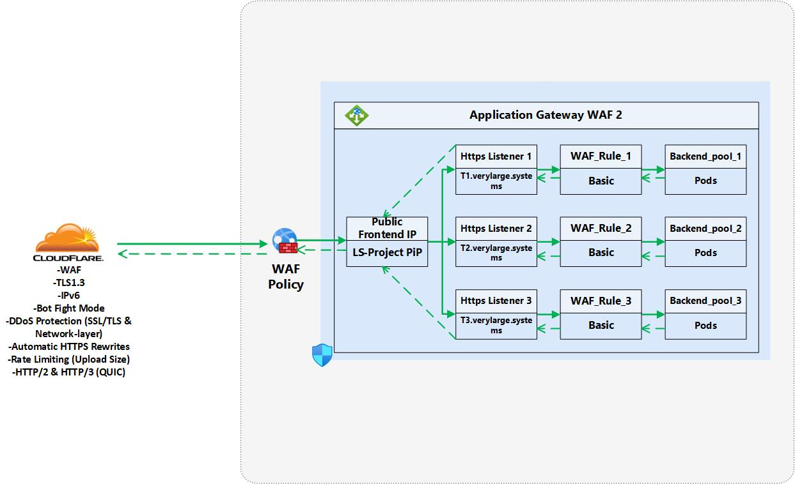
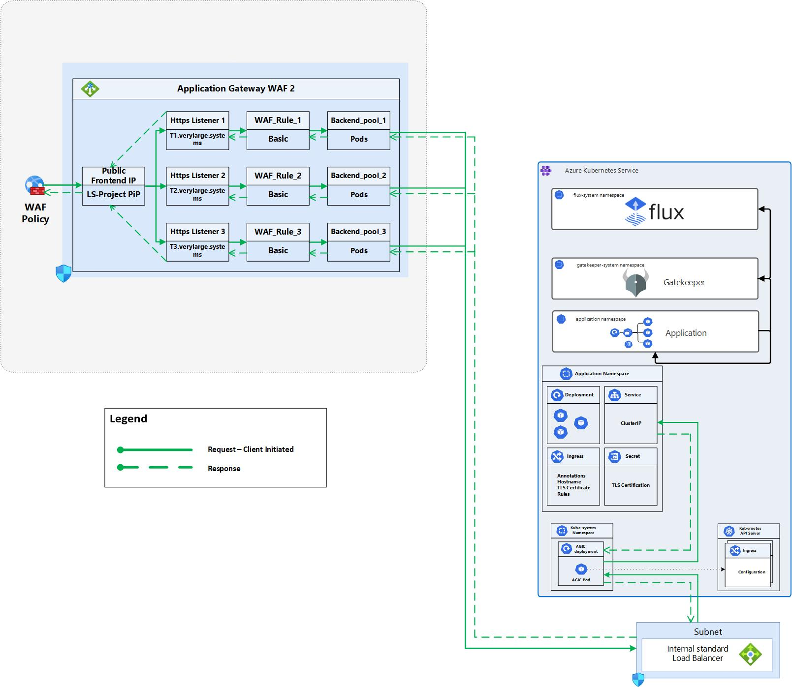
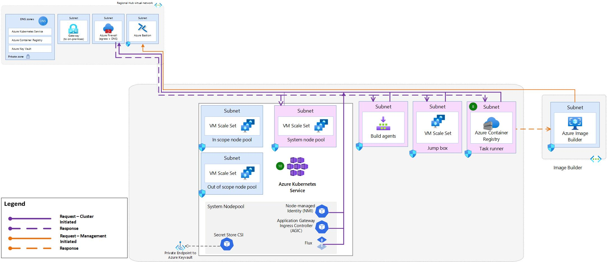
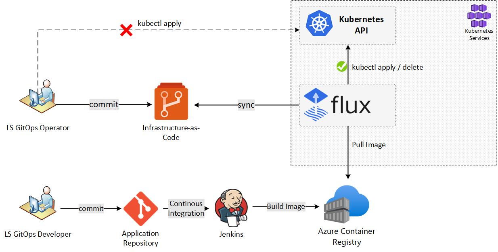
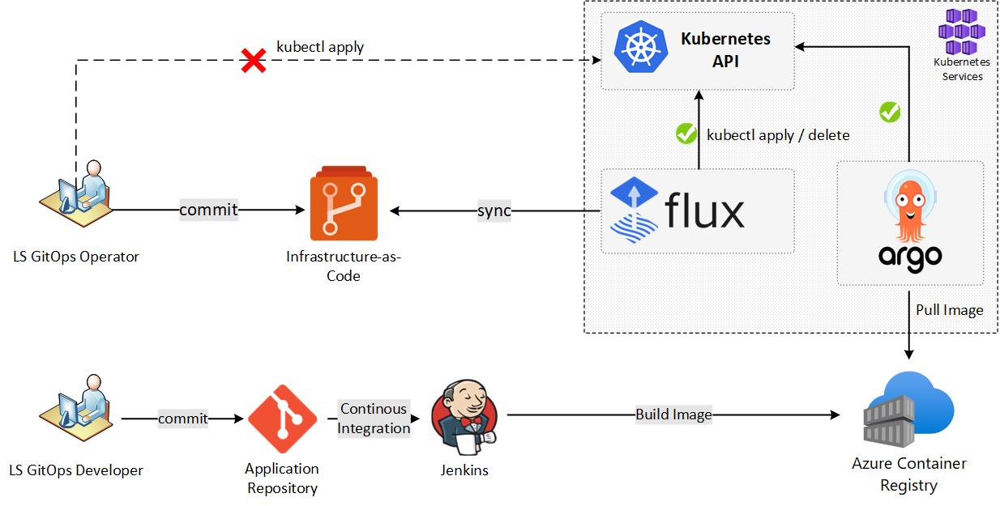
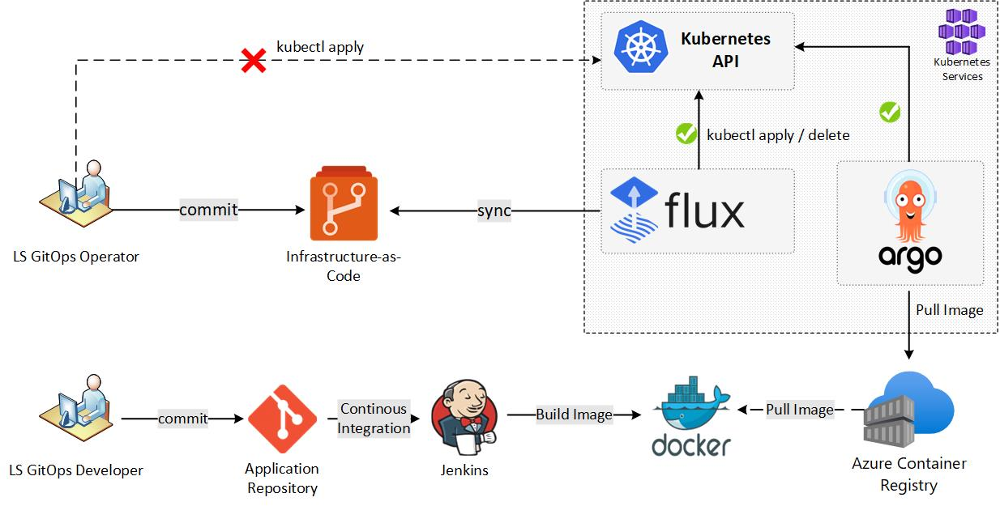
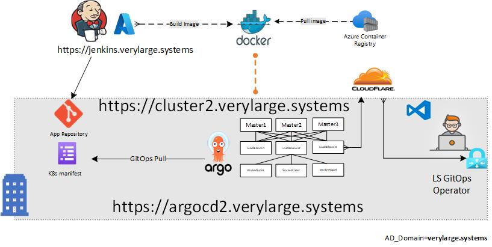

### The architecture of this deployment follows the Microsoft Architecture Center best practices for enterprise-grade deployments on Azure. It includes the following components:

1. **Azure Kubernetes Service (AKS) Cluster:** This is the managed Kubernetes cluster that will host the containerized applications. It provides an API server, control plane, and worker nodes for running the application workloads.
2. **Jenkins CI/CD Pipeline (on-premise):** This is the continuous integration and delivery (CI/CD) platform used for automating the deployment of the application workloads. It includes a Git repository for storing the application code and Kubernetes manifests, as well as a build and release pipeline for automating the deployment process.
3. **Azure Container Registry (ACR):** This is the private container registry used for storing the Docker images used by the application workloads. It integrates with AKS and enables secure and fast deployment of the container images to the AKS cluster.
4. **Azure Monitor:** This is the monitoring and logging platform used for monitoring the health and performance of the AKS cluster and application workloads. It provides real-time visibility into the cluster and enables proactive detection and resolution of issues.
5. **Azure Security Center:** This is the security and compliance platform used for securing the AKS cluster and application workloads. It provides threat protection, vulnerability management, and compliance reporting for the AKS cluster and applications.
6. **Azure Policy:** This is the governance platform used for enforcing policies and standards on the AKS cluster and application workloads. It enables consistent management and enforcement of policies and standards across the AKS environment.
7. **Azure Active Directory (AAD):** This is the identity and access management platform used for authenticating and authorizing users and applications accessing the AKS cluster and application workloads. It provides centralized management of identities and access control policies for the AKS environment.
8. **Firewall TLS Inspection:** This is a security feature that inspects the encrypted traffic flowing in and out of the AKS cluster to detect and block any malicious activity or threats. It ensures that all traffic is secure and complies with organizational policies.
9. **Threat Intelligence:** This is a platform that provides real-time insights into potential threats and vulnerabilities affecting the AKS environment. It helps to identify and respond to any suspicious activity before it becomes a security incident.
10. **Intrusion Detection and Prevention System (IDPS):** This is a security feature that monitors network traffic for suspicious behavior and automatically blocks any malicious activity. It helps to identify and respond to any security incidents quickly.
11. **Cloudflare Web Application Firewall (WAF):** This is a security feature that protects the AKS cluster from web-based attacks, such as SQL injection and cross-site scripting (XSS). It examines incoming traffic and blocks any malicious requests before they reach the AKS cluster.
12. **Cloudflare DDoS Protection:** This is a security feature that protects the AKS cluster from distributed denial-of-service (DDoS) attacks. It monitors incoming traffic and automatically mitigates any DDoS attacks in real-time.
13. **Cloudflare Automatic HTTPS Rewrite:** This is a security feature that automatically redirects all HTTP traffic to HTTPS, ensuring that all traffic is encrypted and secure.
14. **Cloudflare HTTP/2 and HTTP/3 (QUIC):** These are protocol features that improve the performance and security of the AKS cluster. HTTP/2 improves page load times and reduces latency, while HTTP/3 (QUIC) enhances security and reliability.
15. **Cloudflare Rate Limiting:** This is a security feature that limits the number of requests per second from a particular IP address or user agent. It helps to prevent malicious traffic from overwhelming the AKS cluster.
16. **Ingress/Egress Traffic Flow:** This is a feature that provides separate paths for incoming and outgoing traffic flow into and out of the AKS cluster. This ensures that the ingress and egress traffic is directed through the appropriate security measures, such as firewall TLS inspection and Cloudflare WAF, before reaching the AKS cluster.
17. **Firewall Rules:** Firewall rules are used to enforce policies that govern which traffic is allowed or blocked from entering or leaving the AKS cluster. These rules are defined based on organizational policies and are enforced by the firewall.

### Deployment Process
[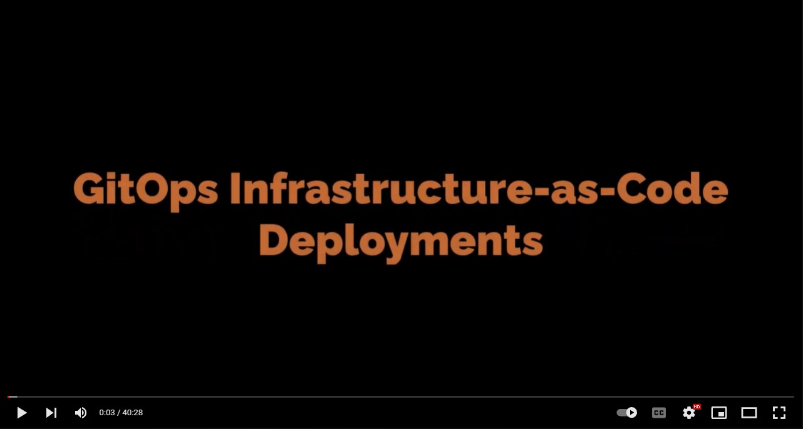](https://www.youtube.com/watch?v=IuR39Xq5ALg)
<!-- The deployment process for this project involves the following steps: -->
